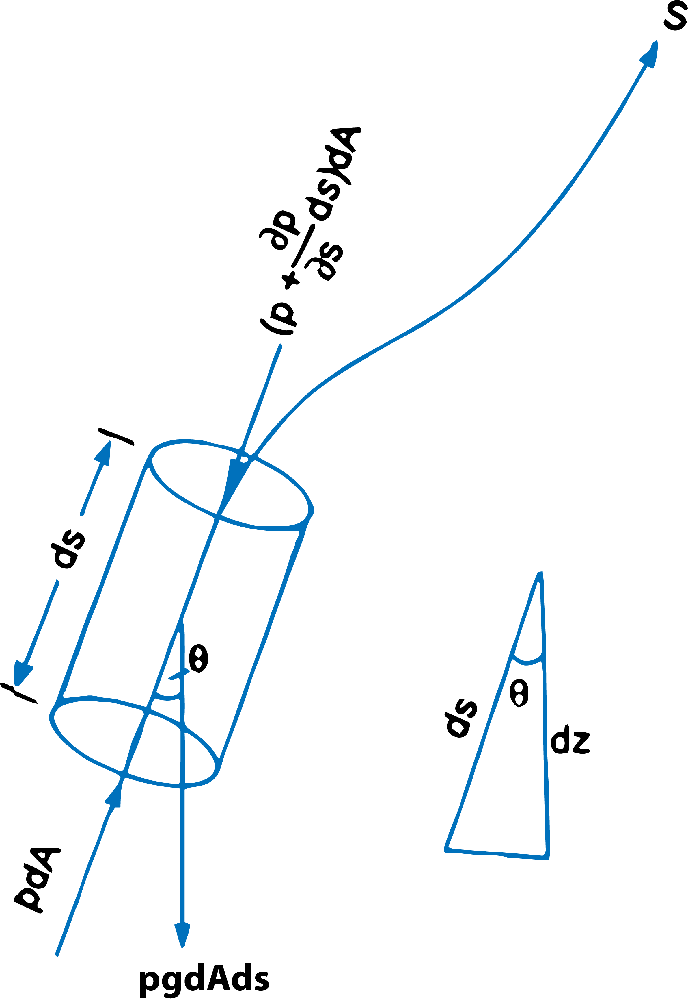
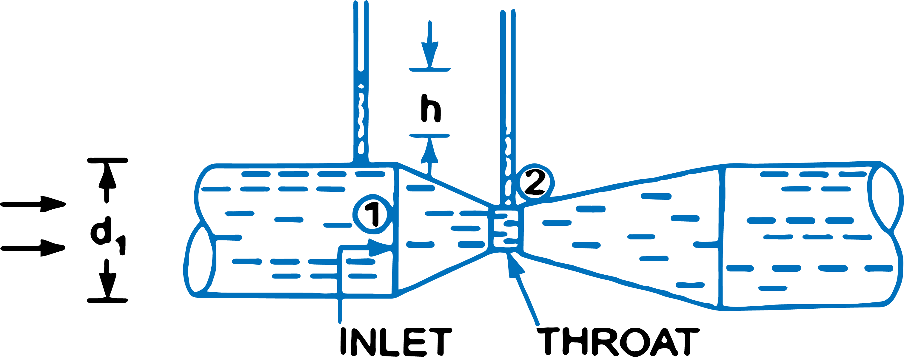

<h2>1. Euler's Equation of Motion</h2>

This is equation of motion in which the forces due to gravity and pressure are taken into consideration. This is derived by considering the motion of a fluid element along a stream-line as :    

Consider a stream-line in which flow is taking place in s-direction as shown in Fig.1. Consider a cylindrical element of cross-section dA and length ds. The forces acting on the cylindrical element are:
 

1. Pressure force pdA in the direction of flow. 

 

2. Pressure force $\left(p+\frac{\partial p}{∂s}ds\right)dA$ opposite of the direction of flow.

 

3. Weight of element ρgdAds.

 

$$ Fig.1\ \ Forces\ on\ a\ fluid\ element $$

 

Let &theta; is the angle between the direction of flow and the line of action of the weight of element The resultant force on the fluid element in the direction of s must be equal to the mass of fluid element &times; acceleration in the direction s.

$$
∴ \qquad pdA - \left(p + \frac{\partial p}{∂s}ds\right)dA - ρgdAds\ cosθ 
$$

$$
= ρdAds × a_s \qquad \qquad \qquad ...equ(1)
$$

where as is the acceleration in the direction of s.

$$
Now \qquad \qquad a_s =  \frac{dv}{dt},\ where\ v\ is\ a\ function\ of\ s\ and\ t.
$$

$$
= \frac{∂v}{∂s}\frac{ds}{dt} + \frac{∂v}{∂t} = \frac{v∂v}{∂s} + \frac{∂v}{∂t} \left\{∵ \frac{ds}{dt} = v\right\}
$$

$$
If\ the\ flow\ is\ steady,\ \frac{∂v}{∂t} = 0
$$

$$
∴ \qquad \qquad  a_s = \frac{v∂v}{∂s}
$$

Substituting the value of as in equation (1) and simplifying the equation, we get

$$
-\frac{∂p}{∂s}dsdA - ρg\ dAds\ cosθ = ρdAds × \frac{∂v}{∂s}
$$

$$
Dividing\ by\ ρdsdA,\ -\frac{∂p}{ρ∂s} - g\ cosθ = \frac{v∂v}{ds}
$$

$$
or \qquad \qquad \frac{∂p}{ρ∂s} + g\ cosθ + v\frac{∂v}{∂s} = 0
$$

But from fig. 1(b), we have,

$$cosθ = \frac{dz}{ds}$$

$$
∴ \quad \frac{1}{ρ} \frac{dp}{ds} + g\frac{dz}{ds}+\frac{vdv}{ds} = 0 \ \ or\ \ \frac{dp}{\rho} + gdz + vdv = 0 \qquad \qquad \qquad ...equ(2)
$$

Equation (2) is known as Euler's equation of motion.

 
<h2>2. Bernoulli's Equation from Euler's Equation</h2>

Bernoulli's equation is obtained by integrating the Euler's equation of motion (2) as

$$
∫\frac{dp}{\rho} + ∫gdz + ∫vdv = constant
$$

If flow is incompressible, &rho; is constant and

$$
∴ \qquad \frac{p}{ρ} + gz + \frac{v^2}{2} = constant 
$$

$$
or \qquad \frac{p}{ρg} + z + \frac{v^2}{2g} = constant
$$

$$
or \qquad \frac{p}{ρg} + \frac{v^2}{2g} + z = constant \qquad \qquad ...equ(3)
$$

Equation (3) is a Bernoulli's equation in which

$$
\frac{p}{ρg} = pressure\ energy\ per\ unit\ weight\ of\ fluid\ or\ pressure\ head.
$$
$$
\frac{v^2}{2g} = kinetic\ energy\ per\ unit\ weight\ or\ kinetic\ head.
$$
$$
z = potential\ energy\ per\ unit\ weight\ or\ potential\ head.
$$

<h2>3. Bernoulli's Equation for Real Fluid</h2>

The Bernoulli's equation was derived on the assumption that fluid is inviscid (non-viscous) and therefore frictionless. But all the real fluids are viscous and hence offer resistance to flow. Thus there are always some losses in fluid flows and hence in the application of Bernoulli's equation, these losses have to be taken into consideration. Thus the Bernoulli's equation for real fluids between points 1 and 2 is given as

$$
\frac{p_1}{ρg} + \frac{v_1^2}{2g} + z_1 = \frac{p_2}{ρg} + \frac{v_2^2}{2g} + z_2 + h_L \qquad \qquad ...equ(4) 
$$

where hL is loss of energy between points 1 and 2.

<h2>4. Venturimeter</h2>

A venturimeter is a device used for measuring the rate of a flow of a fluid flowing through a pipe. It consists of three parts :
<ol type='1'>
   <li>A short converging Part</li>
   <li>Throat, and</li>
   <li>Diverging part.</li>
</ol>

It is based on the Principle of Bernoulli's equation.

<h3>Expression for rate of flow through venturimeter</h3>

Consider a venturimeter fitted in a horizontal pipe through which a fluid is flowing (say water), as shown in Fig. 2.

 

$$ Fig.2\ \ Venturimeter $$

 

Let,
 
d1 = diameter at inlet or at section (1)  
P1 = pressure at section (1)  
v1 = velocity of fluid at section (1) 
a1 = area at section (1) = (&pi;/4)d12  
and d2, p2, v2, a2 are corresponding values at section (2).

Applying Bernouli's equation at sections (1) and (2), we get

$$
\frac{p_1}{ρg} + \frac{v_1^2}{2g} + z_1 = \frac{p_2}{ρg} + \frac{v_2^2}{2g} + z_2
$$

As pipe is horizontal, hence z1 = z2

$$
∴ \qquad \qquad \frac{p_1}{ρg} + \frac{v_1^2}{2g} = \frac{p_2}{ρg} + \frac{v_2^2}{2g}
$$

$$
or \qquad \qquad \frac{p_1 - p_2}{ρg} = \frac{v_2^2}{2g} - \frac{v_1^2}{2g}
$$

But (p1 - p2)/&rho;g  the difference of pressure heads at sections 1 and 2 and it is equal to h or

$$\frac{p_1 - p_2}{ρg} = h$$

Substituting this value of (p1 - p2)/&rho;g in the above equation, we get

$$h =  \frac{v_2^2}{2g} - \frac{v_1^2}{2g} \qquad \qquad \qquad ...equ(5)$$

Now applying continuity equation at sections 1 and 2

$$
a_1v_1 = a_2v_2 \qquad or \qquad v_1 = \frac{a_2v_2}{a_1}
$$

Substituting this value of v1 in equation (5)

$$
h = \frac{v_2^2}{2g} - \frac{(\frac{a_2v_2}{a_1})^2}{2g} = \frac{v_2^2}{2g}\left[1 - \frac{a_2^2}{a_1^2}\right] = \frac{v_2^2}{2g}\left[\frac{a_1^2 - a_2^2}{a_1^2}\right]
$$

$$
or \qquad v_2^2 = 2gh \ \frac{a_1^2}{a_1^2 - a_2^2}
$$

$$
∴ \qquad v_2 = \sqrt{2gh\ \frac{a_1^2}{a_1^2 - a_2^2}} = \frac{a_1}{\sqrt{a_1^2 - a_2^2}}\sqrt{2gh}
$$

$$
∴ \qquad Discharge, \qquad \qquad Q = a_2v_2
$$

$$
= a_2\ \frac{a_1}{\sqrt{a_1^2 - a_2^2}} × \sqrt{2gh} = \frac{a_1a_2}{\sqrt{a_1^2 - a_2^2}} × \sqrt{2gh} \qquad \qquad \qquad ...equ(6)
$$

Equation (6) gives the discharge under ideal conditions and is called, theoretical discharge. Actual discharge will be less than theoretical discharge.

$$
∴ \qquad Q_{act} = C_d × \frac{a_1a_2}{\sqrt{a_1^2 - a_2^2}} × \sqrt{2gh} \qquad \qquad \qquad ...equ(7)
$$

where Cd= Co-efficient of venturimeter and its value is less than 1.

<h3>Value of 'h' given by differential U-tube manometer</h3>

<strong>Case I:</strong> Let the differential manometer contains a liquid which is heavier than the liquid flowing through the pipe. Let

$$
S_h = Sp.\ gravity\ of\ the\ heavier\ liquid
$$
$$
S_o = Sp.\ gravity\ of\ the\ liquid\ flowing\ through\ pipe
$$
$$
x = Difference\ of\ the\ heavier\ liquid\ column\ in\ U-tube
$$

$$
Then, \qquad h = x\left[\frac{S_h}{S_o} - 1\right] \qquad \qquad  \qquad ...equ(8)
$$

<strong>Case II:</strong> If the differential manometer contains a liquid which is lighter than the liquid flowing through the pipe, the value of h is given by

$$
h = x\left[1 - \frac{S_l}{S_o}\right] \qquad \qquad \qquad ...equ(9) 
$$

where

&emsp; &emsp; <i>Sl</i> = Sp. gr. of lighter liquid in U-tube

&emsp; &emsp; <i>So</i> = Sp. gr. of fluid flowing through pipe

&emsp; &emsp; <i>x</i> = Difference of the lighter liquid columns in U-tube

<strong>Case III. Inclined Venturimeter with Differential U-tube manometer.</strong> The above two cases are given for a horizontal venturimeter. This case is related to inclined venturimeter having differential U-tube manometer. Let the differential manometer contains heavier liquid then h is given as

$$
h = \left(\frac{p_1}{ρg} + z_1\right) - \left(\frac{p_2}{ρg} + z_2\right) = x\left[\frac{S_h}{S_o} - 1\right] \qquad \qquad \qquad ...equ(10)
$$

<strong>Case IV.</strong> Similarly, for inclined venturimeter in which differential manometer contains a liquid which is lighter than the liquid flowing through the pipe, the value of h is given as

$$ 
h = \left(\frac{p_1}{ρg} + z_1\right) - \left(\frac{p_2}{ρg} + z_2\right) = x\left[1 -\frac{S_l}{S_o}\right] \qquad \qquad \qquad ...equ(11)
$$